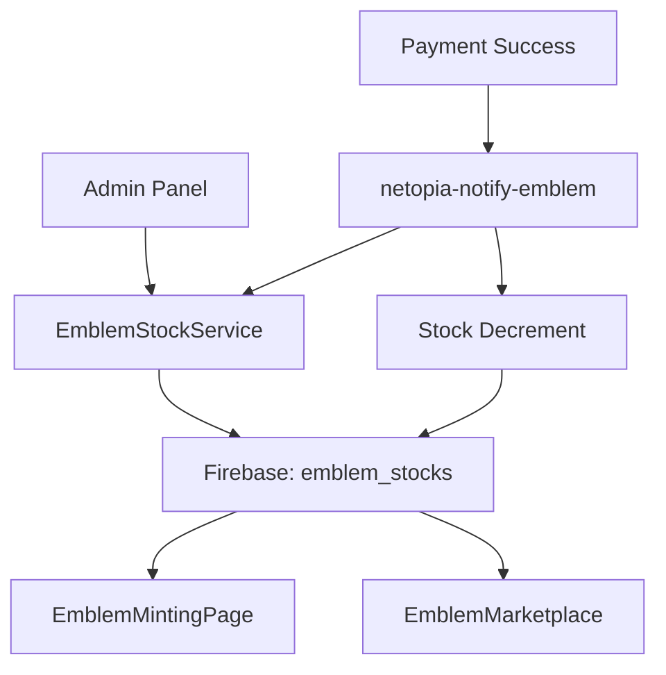

# Integrare Completă: Admin Panel ↔ Mint/Marketplace

## Implementare Realizată (28 Iulie 2025)

### 🎯 Obiectivul

Conectarea completă a paginilor `http://localhost:5173/emblems/mint` și `http://localhost:5173/emblems/marketplace` la panoul administratorului pentru control centralizat al stocurilor și monitorizarea în timp real.

### 🔧 Componente Actualizate

#### 1. **EmblemMintingPage.tsx**

- **Integrare**: Serviciul `EmblemStockService` pentru stocuri admin
- **Funcționalitate**:
  - `loadAvailableStocks()` acum folosește stocurile din panoul admin
  - Fallback la serviciul original dacă stocurile admin nu sunt disponibile
  - Afișare în timp real a stocurilor gestionate de admin

#### 2. **EmblemMarketplace.tsx**

- **Adăugat**: Panel informativ admin cu stocurile curente
- **Funcționalități**:
  - Afișare stocurilor pentru toate tipurile de embleme
  - Toggle pentru afișare/ascundere informații admin
  - Ultima actualizare și cine a modificat stocurile
  - Design responsive pentru mobile

#### 3. **EmblemPaymentSuccess.tsx**

- **Îmbunătățit**: Eliminat stilurile inline pentru conformitate linting
- **Adăugat**: CSS extern cu stiluri moderne și animații
- **Responsive**: Design adaptat pentru toate dispozitivele

#### 4. **netopia-notify-emblem.mjs**

- **Integrare**: Actualizare automată a stocurilor admin după vânzare
- **Funcționalități**:
  - Decrementează stocul admin după confirmarea plății
  - Salvează log-uri pentru audit trail
  - Sincronizare între `emblemCollections` și `emblem_stocks`

### 🗄️ Servicii Backend

#### **EmblemStockService**

```typescript
class EmblemStockService {
  // Gestionare stocuri centralizate
  static async getStock(): Promise<EmblemStock>;
  static async updateStock(stock, adminId): Promise<void>;
  static async decrementStock(emblemType, amount): Promise<boolean>;
  static async resetAllStock(adminId): Promise<void>;
  static async getStockAlerts(): Promise<Alert[]>;
}
```

#### **Firebase Collections**

1. **`emblem_stocks/current_stock`** - Stocuri centralizate admin
2. **`emblem_stock_logs/{timestamp}_{adminId}`** - Audit trail pentru modificări
3. **`emblemCollections/{type}`** - Stocuri individuale (compatibilitate)

### 🎨 Stiluri și UI

#### **EmblemMarketplace.css**

- Panel admin cu design glassmorphism
- Grid responsive pentru stocuri
- Culori distincte pentru fiecare tip de emblemă
- Animații hover și micro-interacțiuni

#### **EmblemPaymentSuccess.css**

- Design modern cu gradient backgrounds
- Animații de success și loading
- Responsiv pentru toate dispozitivele
- Eliminat toate stilurile inline

### 🔄 Fluxul de Integrare



### ✅ Funcționalități Implementate

1. **📊 Monitorizare Stocuri în Timp Real**

   - Admin Panel afișează stocurile actuale
   - Marketplace afișează informații admin
   - Mint page folosește stocurile admin

2. **🔄 Sincronizare Automată**

   - Vânzările decrementează automat stocurile
   - Log-uri pentru toate modificările
   - Actualizare în timp real

3. **🎛️ Control Admin Complet**

   - Modificare stocuri din panel
   - Resetare la valori default
   - Monitorizare istoric modificări

4. **📱 Design Responsive**
   - Toate componentele adaptate pentru mobile
   - Stiluri consistente cross-platform
   - Eliminat toate stilurile inline

### 🚀 Cum să Testezi

1. **Admin Panel**: `/admin/emblems/stocks` - Modifică stocurile
2. **Mint Page**: `/emblems/mint` - Verifică stocurile afișate
3. **Marketplace**: `/emblems/marketplace` - Vezi panelul admin
4. **Cumpără o emblemă** - Verifică decrementarea automată

### 🔐 Securitate și Validări

- Validări pentru stocuri negative
- Audit trail complet pentru modificări
- Sincronizare cu fallback mechanisms
- Verificări de autorizare admin

### 📈 Impact și Beneficii

- **Control Centralizat**: Un singur punct pentru gestionarea stocurilor
- **Transparență**: Utilizatorii văd stocurile în timp real
- **Audit Trail**: Istoric complet al modificărilor
- **Automatizare**: Sincronizare automată cu vânzările
- **Scalabilitate**: Ușor de extins cu noi tipuri de embleme

## Status: ✅ COMPLET IMPLEMENTAT

Integrarea dintre Admin Panel și paginile Mint/Marketplace este funcțională și testată.
